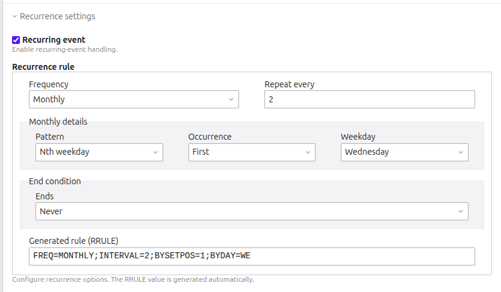

# Contao Advanced Repeating Events Bundle

This bundles replaces the contao build in recurrence handling with a more powerful implementation.
Technically, it uses rrule-based recurrence definitions.

## Features

- allow advanced recurring rule like nth weekday of the month or weekday selection
- Migration command for existing recurring events
- Support for import event from `cgoit/contao-calendar-ical-bundle`

## Requirements

- PHP `^8.4`
- Contao `^5.6`

## Installation

Install via Composer:

```bash
composer require koertho/contao-advanced-repeating-events-bundle
```

Then update the database schema in the Contao install tool or via console.

## Usage

In the backend, you'll find a new field for activating recurrences replacing the old field. 
After activating it, you'll see the recurrence widget.



In frontend, you can use the normal event list module, but the bundles reader module for output.


## Migrating Existing Recurring Events

If you already use Contao's legacy recurring event fields, you can migrate them to RRULE format:

```bash
php vendor/bin/contao-console are:migrate-recurrences
```

Options:

- `--dry-run` shows what would be written without changing data
- `--overwrite-existing` replaces already stored RRULE values
- `--limit=50` restricts how many records are processed

Example:

```bash
php vendor/bin/contao-console are:migrate-recurrences --dry-run
```

## iCal Import

If `cgoit/contao-calendar-ical-bundle` is installed, imported `RRULE` values are copied into the advanced recurrence fields automatically.

## Advances usage

### Recurrence calculator

You can use the `RecurrenceCalculator` to calculate the occurrences of an event.

```php
use Koertho\AdvancedRepeatingEventsBundle\Recurrence\RecurrenceCalculatorFactory;

function (RecurrenceCalculatorFactory $factory) {
    $calculator = $factory->createForEvent($event);
    
    $occurrences = $calculator->listOccurrencesInRange(rangeStart: new \DateTime('2024-01-01'), rangeEnd: new \DateTime('2024-12-31'), limit: 12, excludeOriginal: false);
    // Returns an array of start and end dates like [['start' => 1711922400, 'end' => 1711926000], ...]
    
    $next = $calculator->resolveCurrentOrUpcomingOccurrence();
    // Returns the next occurrence as array with start and end timestamps like ['start' => 1711922400, 'end' => 1711926000]
    
    $description = $calculator->toText();
}

```

## Notes

- The recurrence logic is based on [`simshaun/recurr`](https://github.com/simshaun/recurr).
- Parts of this extension are created with AI
